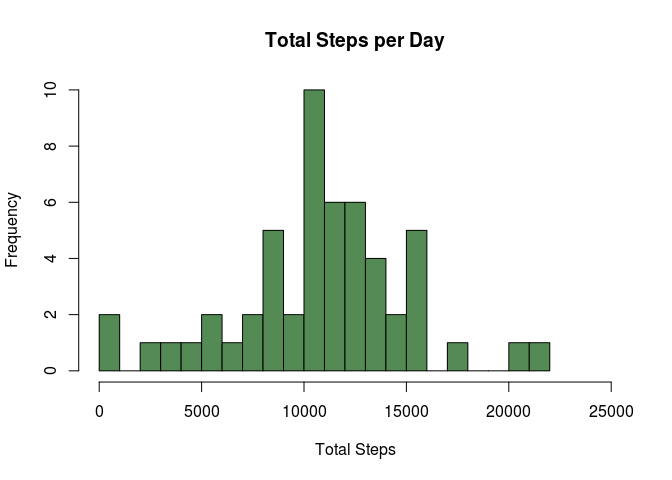
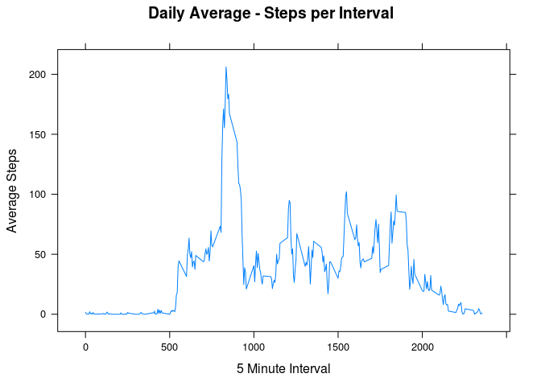
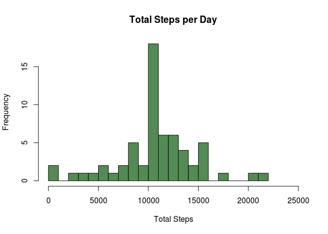
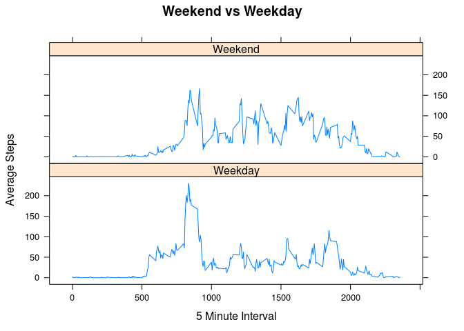

# Reproducible Research: Peer Assessment 1

This markdown file documents the process and code for the first peer assessment.

This assignment makes use of data from a personal activity monitoring device. This device collects data at 5 minute intervals through out the day. The data consists of two months of data from an anonymous individual collected during the months of October and November, 2012 and include the number of steps taken in 5 minute intervals each day.

The raw data is analyzed to determine patterns of activity under various scenarios and presented in a reproducible manner. 


First load the necessary libraries.   

```r
library(tidyr)
library(dplyr)
library(sqldf)
library(lubridate)
library(lattice)
```
## Loading and preprocessing the data   

Load the data into a data frame.   

```r
#check for the test data file in the current directory
if (!file.exists("activity.csv")) stop("The data file is not in the current directory")
#load the file
actdfNA <- read.csv("activity.csv")
```

## What is mean total number of steps taken per day?   
A data frame that summarises the steps for each date is created first.


```r
dfDaySumNA <- sqldf("select date, sum(steps) as steps from actdfNA group by date")
```

Then the histogram is plotted.   

```r
hist(dfDaySumNA$steps, breaks=20, col="palegreen4",main="Total Steps per Day",xlab="Total Steps",xlim=c(0,25000))
```

 

The mean and median of the daily total is also computed.  
Mean-   

```r
mean(dfDaySumNA$steps,na.rm=TRUE)
```

```
## [1] 10766.19
```
Median-   

```r
median(dfDaySumNA$steps,na.rm=TRUE)
```

```
## [1] 10765
```

## What is the average daily activity pattern?     

Create a data frame with the daily activity pattern by 5 minute interval.   

```r
dfIntervalAvg <- sqldf("select interval, avg(steps) as avgsteps from actdfNA group by interval")
```

Plot the daily activity.   
  

```r
xyplot(avgsteps~interval, data=dfIntervalAvg,type="l", layout=c(1,1), main = "Daily Average - Steps per Interval", ylab = "Average Steps", xlab = "5 Minute Interval")
```

 

This 5 minute interval has the highest average steps.   

```r
dfIntervalAvg[which(dfIntervalAvg$avgsteps==max(dfIntervalAvg$avgsteps)),]$interval
```

```
## [1] 835
```

## Imputing missing values    

The strategy for imputing missing values for a time interval is to use the average number of steps for that time interval across all days. This was calculated and stored for the previous question and will be used here. 

First make a copy of the original dataframe.   

```r
actdf <- actdfNA
```

Number of rows with NA values

```r
nrow(actdfNA[!complete.cases(actdfNA),])
```

```
## [1] 2304
```

Loop through and replace NA steps values with the average of steps for that interval calculated earlier - (dfIntervalAvg)   


```r
for ( n in 1:length(actdf$steps) ) {
  dfrow <- actdf[n,] #fetch whole row once to avoid multiple fetches
  if (is.na(dfrow$steps)) { #if NA replace with average steps for that interval
    actdf[n,]$steps <- round(dfIntervalAvg[which(dfIntervalAvg$interval==dfrow$interval),]$avgsteps)
  }
}
```
Create a summary data frame from the new data set. 


```r
dfDaySum <- sqldf("select date, sum(steps) as steps from actdf group by date")
```
Create a histogram from the summary data set. 
There is some change to the pattern especially with the peak day after the NA values were filled in.   


```r
hist(dfDaySum$steps, breaks=20, col="palegreen4",main="Total Steps per Day",xlab="Total Steps",xlim=c(0,25000))
```

 

Calculate the mean-   

```r
mean(dfDaySum$steps,na.rm=TRUE)
```

```
## [1] 10765.64
```
Calculate the median-   

```r
median(dfDaySum$steps,na.rm=TRUE)
```

```
## [1] 10762
```
Both the mean and median have changed slightly as expected after the NA values were imputed. There is no great change for two reasons. There are only 2304 out of 17000+ rows with NA values. Also using the average values to impute missing values also minimizes the effect on averages. 

## Are there differences in activity patterns between weekdays and weekends?   

Create a new column that indicates the type of day. 

```r
#day of weeks are numbered 1-7, 1 being Sunday and 7 Saturday
actdf$wkdy  <- ifelse(test=(wday(actdf$date) %in% c(1,7)), yes = 'Weekend', no = 'Weekday')
```
Create a summary data set.   


```r
dfweek <- sqldf("select interval, wkdy, avg(steps) as avgsteps from actdf group by interval,wkdy")
```

Create a plot with two panels, one for week days and the other for weekend days.

```r
xyplot(avgsteps~interval|wkdy, data=dfweek,type="l", layout=c(1,2), main = "Weekend vs Weekday", ylab = "Average Steps", xlab = "5 Minute Interval")
```

 

An interesting pattern has emerged that reveals a lot about the individual under observation. On weekdays the life style is rather sedentary during the day, like someone who works in an office sitting at a desk. However on weekends you see a more active life style during the day.


